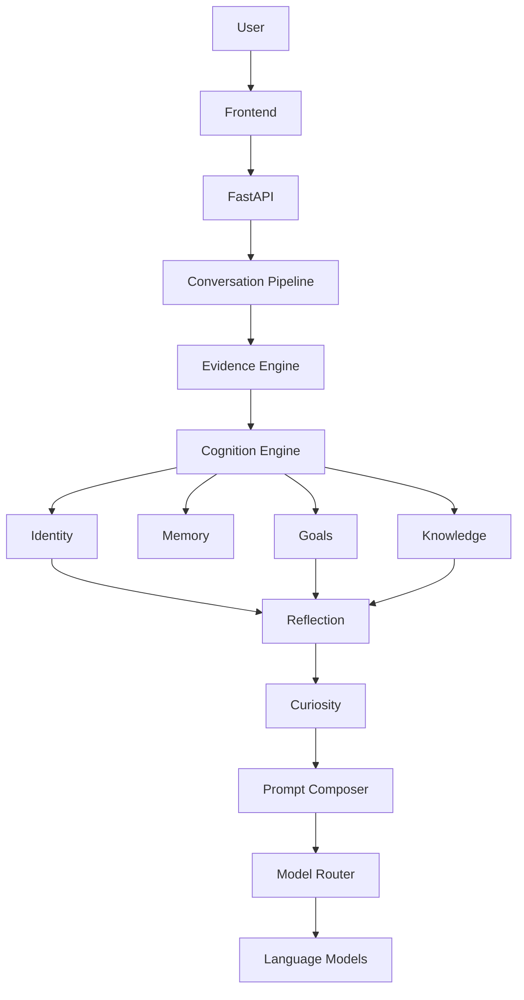
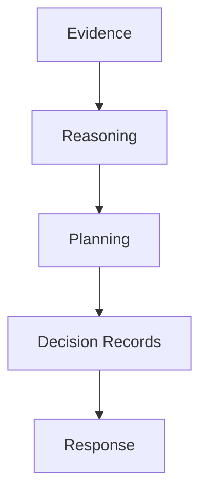

# OMEGA-ARC System Overview

## Mission

OMEGA-ARC is a conversational, evidence-aware architecture for building reliable software assistants. Its purpose is not to imitate human intuition, but to provide a structured system for observing, storing, and reasoning over facts with clear provenance.

## Project Vision

The long-term vision is a system that can:

- understand identity and context without overclaiming certainty
- preserve goals, memory, and knowledge separately
- reason over structured evidence rather than raw assumptions
- route work to the most appropriate model or capability
- remain legible to future contributors

## Current Repository Structure

- backend/app.py — FastAPI entry point and conversation orchestration
- backend/awareness_engine.py — separation of configuration and runtime health
- backend/services/ — modular services for cognition, identity, goals, knowledge, reflection, curiosity, and evidence
- backend/tests/ — regression and acceptance tests
- backend/data/ — stored state such as goals, knowledge, evidence, and constitution
- backend/docs/decisions/ — architecture decisions and design rationale
- docs/ — living architecture and philosophy documentation

## Current Architecture Diagram

## Epoch VI Additions

Epoch VI introduces persistent deterministic planning and decision provenance.

- Plans are first-class persistent objects under backend/data/plans.json.
- Decisions are first-class provenance records under backend/data/decisions.json.
- Planning consumes goals, evidence, and reasoning output.
- Planning proposes steps but never executes them.
- Decisions preserve concise rationale and evidence references.

### Updated Logical Flow

## Current Epoch Timeline

- Foundational Era
  - Identity
  - Cognition
  - Evidence
  - Goals
  - Knowledge Graph
  - Reflection
  - Curiosity
  - Model Routing
  - Tests
  - ADRs

- Systems Era (next)
  - Reasoning over evidence
  - Planning and action selection
  - Perception and environment awareness
  - Broader world interaction
  - Stewardship and long-term maintenance

## Subsystem Summary

- Identity: tracks explicit user identity facts and avoids over-inference
- Cognition: extracts candidate goals, projects, corrections, and configuration from conversation
- Evidence: records provenance, confidence, freshness, and dependency relationships
- Goals: stores persistent goals with update semantics
- Knowledge Graph: stores structured knowledge and relationships
- Reflection: converts observed behavior into signals for later use
- Curiosity: offers optional follow-up questions without dominating the conversation
- Model Routing: selects an appropriate model for general, technical, and vision workloads

## Persistence Summary

OMEGA-ARC persists structured state in JSON-backed files under backend/data/ and a local SQLite-backed runtime store when needed.

- backend/data/goals.json — goal state
- backend/data/knowledge_graph.json — knowledge graph state
- backend/data/evidence.json — evidence records
- backend/data/plans.json — persistent plan records
- backend/data/decisions.json — persistent decision records
- backend/data/constitution.json — operating principles
- backend/omega_arc.db — runtime persistence used by the application

## Testing Summary

The backend uses unittest-based regression and acceptance tests.

- backend/tests/ — service and integration tests
- Current suite count: 59 tests passing

## Roadmap Summary

The immediate roadmap is to deepen reasoning over structured evidence before introducing more autonomous behaviors. The next major phase is a Reasoning Engine that reasons over the evidence graph and produces actionable insights.

## Future Modules

Planned future work includes:

- Reasoning Engine
- Planning and action selection
- Web and document perception
- Vision and multimodal reasoning
- Broader runtime diagnostics and stewardship
