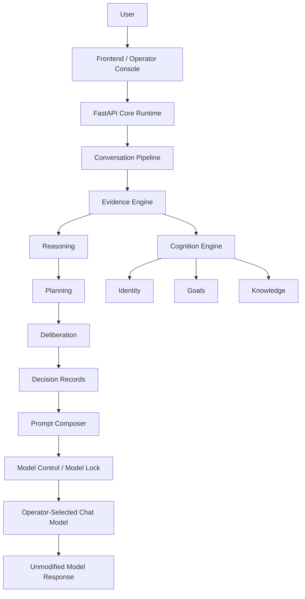

# OMEGA-ARC System Overview

This overview reflects the current epoch (**Epoch X — Memory**, release 0.3.2). For
delivery status see [`PROJECT_STATUS.md`](PROJECT_STATUS.md) and [`ROADMAP.md`](ROADMAP.md); the
release-identity authority is [`docs/architecture/versioning.md`](docs/architecture/versioning.md).

## Mission

OMEGA-ARC is a conversational, evidence-aware architecture for a persistent local intelligence. Its
purpose is not to imitate human intuition, but to provide a structured, local-first system for
observing, storing, and reasoning over facts with clear provenance — with a deterministic runtime
boundary and reviewable growth.

## Project Vision

The long-term vision is a system that can:

- understand identity and context without overclaiming certainty
- preserve goals, memory, and knowledge separately, with provenance
- reason over structured evidence rather than raw assumptions
- change the active model only through an explicit, recorded operator action (Model Lock)
- be observed and operated from native operator consoles without a redeploy
- remember durably, by subject, under review (Epoch X); eventually learn under review (Tutelage)
- remain legible and reversible for future contributors

## Repository Structure

- `backend/` — FastAPI Core Runtime: conversation orchestration, cognition/identity/goals/knowledge,
  the evidence and reasoning engines, planning and deliberation, the bounded-tool framework, the
  authoritative RuntimeStore, and the mobile runtime API
- `bridge/bridge-zero/` — desktop Bridge Zero (Mission Control), a read-only operations console
- `bridge/bridge-zero-ios/`, `bridge/bridge-zero-android/` — native operator consoles
- `bridge/shared/` — the shared mobile contract, design tokens, fonts, and the app-icon source
- `frontend/` — the Command Deck web UI (chat surface)
- `docs/` — living architecture, governance, and decision records (ADRs)
- `scripts/` — launch, health-check, and backup tooling

## Cognition Pipeline

```mermaid
flowchart TD
    User[User] --> Frontend[Frontend / Operator Console]
    Frontend --> FastAPI[FastAPI Core Runtime]
    FastAPI --> Conversation[Conversation Pipeline]
    Conversation --> Evidence[Evidence Engine]
    Evidence --> Reasoning[Reasoning]
    Reasoning --> Planning[Planning]
    Planning --> Deliberation[Deliberation]
    Deliberation --> Decisions[Decision Records]
    Evidence --> Cognition[Cognition Engine]
    Cognition --> Identity[Identity]
    Cognition --> Goals[Goals]
    Cognition --> Knowledge[Knowledge]
    Decisions --> Prompt[Prompt Composer]
    Prompt --> Control[Model Control / Model Lock]
    Control --> ActiveModel[Operator-Selected Chat Model]
    ActiveModel --> DirectResponse[Unmodified Model Response]
```

## Runtime Operations (Epoch IX)

Epoch IX makes the runtime observable and operable rather than adding a new cognition layer.

- An authoritative **RuntimeStore** is the single source of live runtime state.
- Typed **SSE events** and an in-process event bus replace polling; native clients consume
  `/api/mobile/v1/events`.
- **Measured telemetry** (CPU, RAM, latency, tool queue, streaming state, connected clients, current
  session, Chronicle) feeds an **Operations Dashboard**.
- **Model Lock** guarantees the active model changes only on an explicit, recorded operator action.
- **Operator actions (IX-C)** — model selector, new conversation, and approvals with on-device
  biometric confirmation — flow through existing gates; nothing bypasses the deterministic boundary.

## Epoch Timeline

- **Foundational Era** — Continuity/modular backend (I), Identity (II), Cognition (III), Evidence (IV)
- **Systems Era** — Reasoning (V), Planning (VI), Deliberation (VII), Trusted Diagnostics / bounded
  tools (VIII)
- **Operations Era** — Runtime Operations (IX): mobile + desktop operator consoles, telemetry,
  operator actions
- **Memory Era (current)** — Memory (X): benchmarked recall, rooms, reviewed revision and
  consolidation
- **Next** — Tutelage and Learning (proposed)

## Subsystem Summary

- Identity — tracks explicit user identity facts and avoids over-inference
- Cognition — extracts candidate goals, projects, corrections, and configuration from conversation
- Evidence — records provenance, confidence, freshness, and dependency relationships
- Reasoning — deterministic reasoning over the evidence graph, with contradiction/uncertainty handling
- Planning & Deliberation — persistent, proposal-only plans; deterministic comparison and approval
- Bounded Tools — approval-gated, scoped adapters that turn results into evidence (execution off by default)
- Model Control — Model Lock and Direct Model mode; the operator selects the active chat model
- Runtime Operations — RuntimeStore, typed events, telemetry, and the operator consoles
- Memory — embedded recall over a single SQLite-backed store: hybrid ranking (cosine + recency, with
  lexical/fuzzy knobs), rooms (scoped recall + global wing), reviewed supersession and consolidation,
  and an operator review surface — all measured by the recall benchmark

## Persistence Summary

OMEGA-ARC persists structured state in JSON-backed files under `backend/data/` and a local
SQLite-backed runtime store when needed.

- `goals.json`, `knowledge_graph.json`, `evidence.json` — cognition and evidence state
- `plans.json`, `decisions.json` — persistent plans and decision provenance
- `deliberations.json`, `assumptions.json`, `approvals.json` — deliberation state
- `tool_requests.json`, `tool_results.json` — bounded-tool requests and results
- `constitution.json` — operating principles
- `omega_arc.db` — runtime persistence, including the `memories`, `supersession_candidates`, and
  `memory_events` tables (long-term memory, its review queue, and its audit trail)

## Testing Summary

The backend uses regression and acceptance tests run under `pytest`, hermetic (tests redirect mutable
stores to a temporary data directory and leave tracked runtime data unchanged).

- `backend/tests/` — service and integration tests
- Current suite count: **382 passing** on the Epoch X line (see [`CHANGELOG.md`](CHANGELOG.md) for per-release counts)

## Roadmap Summary

Reasoning, planning, deliberation, bounded tools, and runtime operations are delivered. Epoch X —
Memory — is the current epoch: benchmarked recall, temporal-aware ranking, rooms with scope
assignment, reviewed supersession, a memory review surface, and consolidation are shipped (ADRs
0016–0023). The next major phase is the proposed **Tutelage and Learning** epoch, which this memory
substrate exists to serve. See [`ROADMAP.md`](ROADMAP.md) for the living plan.
