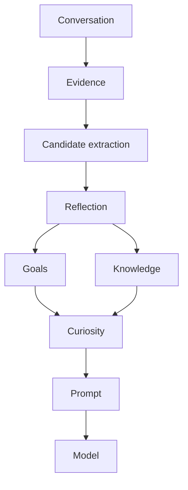

# Cognition Pipeline

## Overview

The cognition pipeline transforms conversation into structured candidates that can influence goals, knowledge, identity, and evidence. The important distinction is that cognition does not create truth. It creates candidates that must be evaluated through evidence.

## Why Cognition Does Not Create Truth

The system separates:

- what the user said
- what the system configured
- what the system inferred
- what the system observed
- what the system verified

That distinction is essential. A candidate can be relevant without being authoritative.

## Pipeline Stages

1. Conversation intake
2. Evidence intake
3. Candidate extraction
4. Reflection generation
5. Goal update
6. Knowledge update
7. Curiosity selection
8. Prompt composition
9. Model response

## Design Intent

The cognition pipeline exists to convert raw interaction into structured artifacts. Those artifacts are then normalized through the evidence engine before they influence more durable systems.
