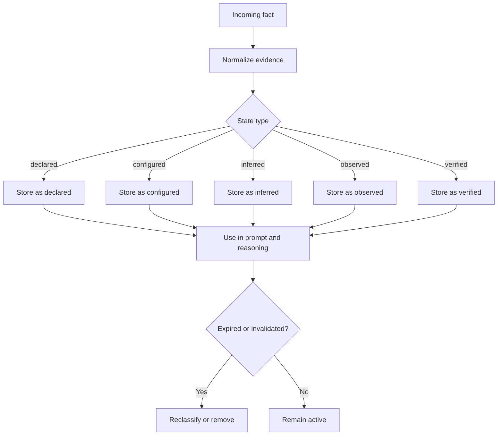

# Evidence Lifecycle

## Overview

Evidence is the backbone of OMEGA-ARC. It makes the system legible by recording what is known, why it is believed, and how long it should remain trusted.

## Lifecycle Diagram

## Evidence Creation

Evidence is created whenever a fact is introduced through a supported pathway:

- a user declaration
- a system configuration value
- an observed runtime event
- a verification result
- an inference candidate

The engine stores provenance and confidence alongside the value.

## Evidence Promotion

An evidence record can become stronger over time. For example:

- a declared fact may later become observed
- an observed fact may later become verified

Promotion occurs when the system receives stronger support for the same fact.

## Evidence Invalidation

Evidence is invalidated when its underlying support disappears or changes. Examples include:

- a backend port changes
- a dependency is updated
- a previous observation is superseded

Invalidation keeps the system from treating stale or superseded facts as if they were still current.

## Dependency Invalidation

Some evidence depends on other evidence. When a dependency changes, dependent evidence should be reconsidered.

Example:

- backend health depends on backend port
- changing the port invalidates prior health evidence until it is re-verified

## Expiration

Observation-based evidence may expire. This prevents long-lived assumptions from silently becoming truths.

## Verification

Verification is a stronger state than observation. Verification means the system has current evidence that the state holds.

Important distinction:

- configuration does not imply verified runtime health
- inference does not imply verification

## Conflict Handling

When two evidence records conflict, the system prefers the higher-ranked state. A verified record outranks an inferred record. A correction can replace a previous declaration when the new evidence is stronger or more specific.

## Prompt Rendering

Evidence should be rendered in prompt summaries in human-readable form, not raw JSON. The prompt should make provenance clear and avoid overstating certainty.
