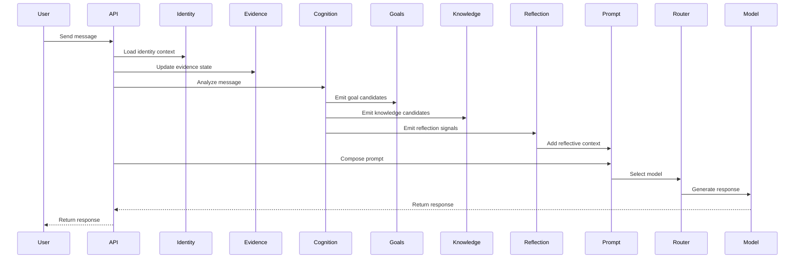

# Request Lifecycle

## Overview

A request moves through a sequence of layers that preserve context, evidence, and intent. The design favors explicit state transitions over hidden inference.

## Step-by-step

1. User sends a message.
2. The API receives the request and gathers the current context.
3. Identity state is loaded so the system can interpret the user appropriately.
4. Evidence is updated to reflect any new declarations, observations, or confirmations.
5. Cognition extracts structured candidates from the interaction.
6. Goals and knowledge stores are updated when appropriate.
7. Reflection captures corrections or behavior that should influence future handling.
8. Prompt composition assembles the relevant context.
9. The router selects the best model or capability.
10. The model produces the response.
11. Relevant state is persisted.
12. The response is returned to the user.

## Design Intent

This flow is intentionally explicit. The system is not a black box that silently invents beliefs. Each stage contributes a well-defined kind of information.
